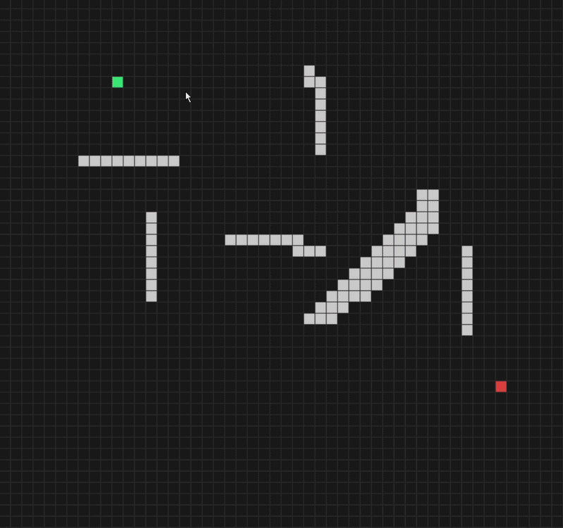

# A* Pathfinding Visualizer & Maze Generator

An interactive desktop application built in Python that visualizes the A* search algorithm and generates perfect mazes. 

## Features
* **A* Pathfinding:** Visualizes the shortest path between two points, factoring in orthogonal and diagonal movement using Euclidean heuristics.
* **Procedural Maze Generation:** Press `M` to instantly generate a perfect maze using the Recursive Backtracking (Depth-First Search) algorithm.
* **Interactive Grid:** Draw walls with left-click, erase with right-click, and clear paths while keeping walls intact for continuous testing.
* **Modern UI:** Built with an object-oriented architecture and a sleek dark-mode look.

## Controls
* **Left Click:** Place Start Node, End Node, or Walls.
* **Right Click:** Erase Node/Wall.
* **Spacebar:** Run A* Algorithm.
* **M:** Generate Random Maze.
* **R:** Reset Path (Keeps Walls).
* **C:** Clear Entire Grid.

## How to Run Locally
1. Clone this repository:
   `git clone https://github.com/imshaikrehan/AStar-Maze-Visualizer.git`
2. Install the required dependencies:
   `pip install -r requirements.txt`
3. Run the application:
   `python main.py`